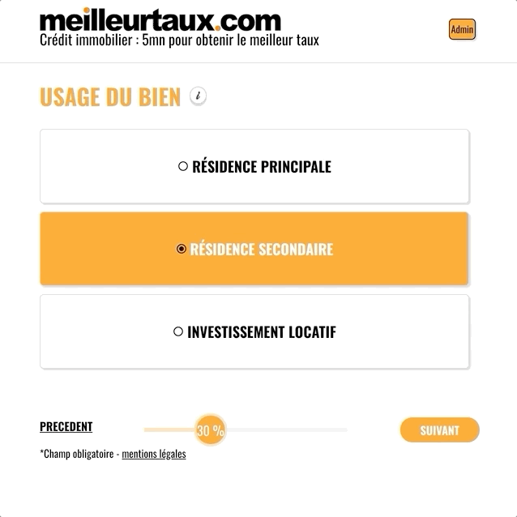

## Description

This is a fullstack simplified version of www.meilleurtaux.com, a french website that gives you quotes for loans.
I added a few sounds for the fun, and a back-office with a very ... "modern" design with a random color generator ;)
The percentage bar and its turning wheel are CSS home made !

## Technologies

### Frontend

React, CSS, Axios, the Vipoco API is used to propose ZipCodes

### Backend

Node.js, express, mongoDB, MailGun
